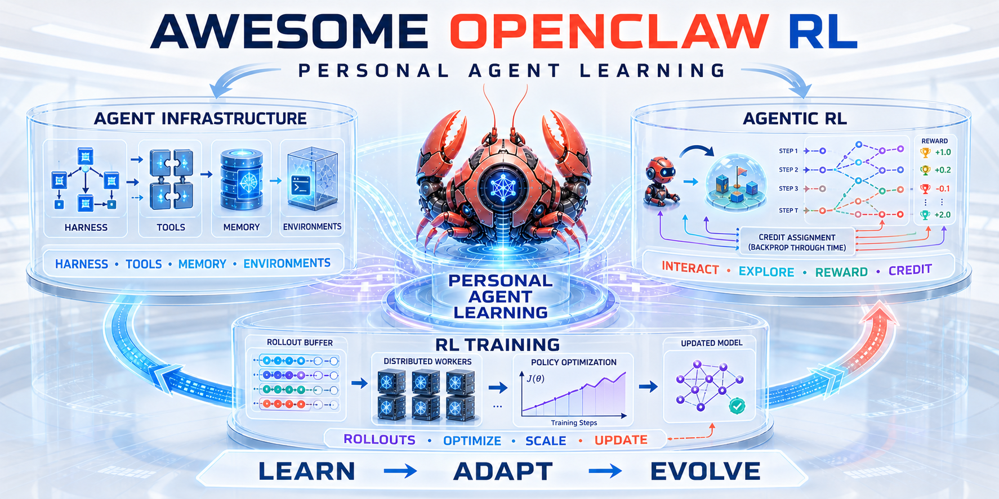

# 🦞 Awesome-OpenClaw-RL

> A curated list of open-source projects at the intersection of **Agent Infrastructure** and **Reinforcement Learning** — focused on training and improving LLM Agents via RL, especially through natural conversation feedback and online continual learning.

---

## 📖 Table of Contents

- [Core Projects (Personal Agent Learning Ecosystem)](#-core-projects---personal-agent-learning-ecosystem)
- [Agentic RL Frameworks](#-agentic-rl-frameworks)
- [RL Training Infrastructure](#-rl-training-infrastructure)
- [Agent Infrastructure](#-agent-infrastructure)
- [Comparison Matrix](#-comparison-matrix)
- [Key Research Directions](#-key-research-directions)
- [Related Resources](#-related-resources)

---

## 🎯 Core Projects — Personal Agent Learning Ecosystem

Projects at the center of personal-agent learning: systems that enable assistants to learn, adapt, or improve continuously through RL, interaction traces, skills, memory, or online feedback. This includes both [OpenClaw](https://github.com/openclaw/openclaw)-based projects and closely related independent systems.

### [OpenClaw-RL](https://github.com/Gen-Verse/OpenClaw-RL) 
`TypeScript` | Train a personalized agent simply by talking to it.

- Fully asynchronous 4-component loop: serving, rollout collection, PRM/judge evaluation, policy training
- Three learning paradigms: **Binary RL** (GRPO), **OPD** (On-Policy Distillation), **Combine**
- General agent support: terminal, GUI, SWE, tool-call scenarios
- LoRA training + local GPU / cloud ([Tinker](https://thinkingmachines.ai/tinker/)) deployment
- Zero manual labeling — automatically organizes multi-turn interactions into training trajectories
- Recent recipes add Qwen3.5 support and multi-user feedback collection
- 📄 [Technical Report](https://arxiv.org/abs/2603.10165) — #1 on [HuggingFace Daily Papers](https://huggingface.co/papers/2603.10165)

### [MetaClaw](https://github.com/aiming-lab/MetaClaw) 
`Python` | Just talk to your agent — it learns and EVOLVES.

- OpenAI-compatible proxy intercepts interactions + injects skills + meta-learns
- No GPU cluster needed — cloud LoRA training via Tinker/MinT
- Smart scheduler: RL weight updates only during idle/sleep/meeting windows
- Auto skill summarization and evolution after each session
- Three modes: `skills_only` / `rl` / `madmax` (default: RL + scheduler)

### [Claw-R1](https://github.com/AgentR1/Claw-R1) 
`Python` | Step-level data middleware and lifecycle management for Agentic RL.

- **Middleware Layer** (Gateway Server + DataPool) decouples Agent side from Training side
- Three modes: white-box offline, black-box offline, black-box online service
- Zero-code intrusion: black-box agents (LangChain, AutoGen, CrewAI) just point `base_url` to Gateway
- Dashboard for collection monitoring, step-level representation, curation, prefix-tree optimization, and training consumption
- Human-feedback pipeline and dataset versioning on the roadmap
- 🏫 USTC Cognitive Intelligence State Key Lab
- 📄 [Technical Report](https://arxiv.org/abs/2606.09138) | [Documentation](https://agentr1.github.io/Claw-R1/)

### [OpenJarvis](https://github.com/open-jarvis/OpenJarvis) 
`Python` | An open, modular, local-first personal AI stack that learns from its own interactions.

- Closed learning loop turns local interaction traces into model, prompt, agent-logic, and configuration improvements
- Supports weight optimization with **SFT** and **GRPO**
- Supports prompt and agent optimization with **DSPy**, **GEPA**, and **ACE**
- Modular stack spanning inference, agents, tools, memory, learning, and evaluation
- Local-first execution keeps user data and learning traces under user control
- 🏫 Stanford University
- 📄 [Paper](https://arxiv.org/abs/2605.17172) | [Project Website](https://openjarvis.stanford.edu/)

### [ClawGym](https://github.com/ClawGym/ClawGym-Agents) 
`Python` | A full-lifecycle data, training, and evaluation stack for Claw-style personal agents.

- 13.5K tasks and 24.5K agent trajectories spanning realistic personal-assistant workflows
- End-to-end recipes for supervised fine-tuning and reinforcement learning
- Released datasets, model checkpoints, training code, and the ClawGym-Bench evaluation suite
- **ClawGym II** extends black-box RL to deployed harnesses including OpenClaw and Claude Code
- Mix-harness training improves cross-harness generalization
- 📄 [ClawGym Paper](https://arxiv.org/abs/2604.26904) | [ClawGym II](https://arxiv.org/abs/2608.16798)

---

## 🤖 Agentic RL Frameworks

General-purpose frameworks for training LLM Agents with reinforcement learning.

### [Dressage](https://github.com/Accio-Lab/Dressage) 
`Python` | Train real-world agents on their native harnesses with black-box or white-box RL.

- Supports OpenClaw, Claude Code, Codex, OpenCode, and other existing agent harnesses
- Proxy-based black-box mode requires no modification to the agent implementation
- White-box mode enables token-level optimization and deeper trainer integration
- Built on [Slime](https://github.com/THUDM/slime) for scalable asynchronous training
- OpenClaw recipe improves strict Claw-Eval Pass^3 from 41.4 to 55.4

### [OpenForgeRL](https://github.com/MSR-Orchard/OpenForge-RL) 
`Python` | Harness-native RL for agents running in OpenClaw, Codex, ZeroClaw, and other real systems.

- Recording proxy converts native harness interactions into trainable trajectories
- Container and Kubernetes execution for isolated, reproducible agent environments
- Training integration with [veRL](https://github.com/volcengine/verl)
- Separates harness execution, trajectory collection, reward evaluation, and policy updates
- 🏫 Columbia University, Dartmouth College, and Microsoft Research
- 📄 [Paper](https://arxiv.org/abs/2607.21557)

### [Agent Lightning](https://github.com/microsoft/agent-lightning) 
`Python` | Train agents built with almost any framework without rewriting their logic.

- Lightweight proxy and tracing layer separates agent execution from RL optimization
- Supports real coding-agent harnesses and long-horizon, multi-step trajectories
- Credit assignment decomposes complex executions into trainable transitions
- Agent Lightning v1.0 provides a compact, fully refactored training stack
- Qwen3.5-9B improves from 41.8 to 56.4 on SWE-bench Verified in the released coding-agent pipeline
- 📄 [Paper](https://arxiv.org/abs/2608.17528)

### [Uni-Agent](https://github.com/verl-project/uni-agent) 
`Python` | veRL's framework for scalable long-horizon RL on arbitrary agent harnesses.

- Harness-agnostic integration for Claude Code, Mini-SWE-Agent, and custom agents
- Fully asynchronous GRPO/GSPO training with partial-rollout support
- Scales to 1,000+ concurrent stateful agent sessions
- Decouples rollout workers, environments, inference, and training services
- Maintained in the veRL ecosystem

### [AgentJet](https://github.com/modelscope/AgentJet) 
`Python` | Distributed reinforcement learning for heterogeneous swarms of agents.

- Jointly trains multiple agents with different roles, models, tools, and execution environments
- Native support for decentralized and hierarchical multi-agent workflows
- Includes an OpenClaw training recipe
- Distributed rollout and training across heterogeneous compute resources
- 📄 [Paper](https://arxiv.org/abs/2606.04484)

### [ART](https://github.com/OpenPipe/ART) 
`Python` | A practical Agent Reinforcement Trainer for multi-step agents.

- GRPO training over real agent trajectories with custom tools and environments
- Works with existing agent code through a lightweight rollout interface
- Supports local and distributed training backends
- Built-in trajectory inspection, reward tracking, and experiment workflows

### [SkillRL](https://github.com/aiming-lab/SkillRL) 
`Python` | Co-evolve an agent policy and its reusable skill library through reinforcement learning.

- Alternates policy optimization with automatic skill discovery and refinement
- Turns successful trajectories into reusable procedural knowledge
- Skill retrieval improves exploration and long-horizon task solving
- Connects weight learning with explicit, inspectable agent capabilities
- 📄 [Paper](https://arxiv.org/abs/2602.08234)

### [Agent-R1](https://github.com/AgentR1/Agent-R1) 
`Python` | Training Powerful LLM Agents with End-to-End RL.

- Define domain-specific tools and reward functions to extend
- Supports GRPO, Reinforce++, process rewards
- Multi-modal support (VLM)
- Custom tool environments (e.g., ReTool implementation)
- 📄 [Technical Report](https://arxiv.org/abs/2511.14460)

### [rLLM](https://github.com/rllm-org/rllm) 
`Python` | Democratizing Reinforcement Learning for Language Agents.

- Custom agents & environments, RL training + deployment in one framework
- **AgentWorkflowEngine** for training over arbitrary agentic programs
- Flagship models: [DeepCoder-14B](https://huggingface.co/collections/rLLM/deepcoder-preview-67a40fa53b2d9f72c6c1b0cd) (matches o3-mini), [DeepSWE-32B](https://huggingface.co/collections/rLLM/deepswe-preview-67a40fa53b2d9f72c6c1b0cd) (#1 open-weight on SWEBench)
- Integrated verl-0.5.0 + Megatron, LoRA and VLM training support
- 🏫 UC Berkeley Sky Computing Lab
- 📄 [Blog](https://rllm-project.com/blog)

### [Polar (formerly ProRL Agent)](https://github.com/NVIDIA-NeMo/ProRL-Agent-Server) 
`Python` | Agentic RL on any real-world harness at scale (NVIDIA NeMo).

- Evolved from ProRL Agent's **Rollout-as-a-Service** architecture into a harness-neutral framework
- Low-intrusion integration for diverse training stacks and native agent harnesses
- Built-in evaluators, sandboxed execution, and distributed rollout services
- Slime bridge and end-to-end SWE-Gym GRPO example
- Rootless HPC and Apptainer deployment support
- 🏢 NVIDIA NeMo Gym
- 📄 [Polar Paper](https://arxiv.org/abs/2605.24220) | [ProRL Agent Paper](https://arxiv.org/abs/2603.18815)

### [MiniMax Forge](https://www.minimax.io/news/forge-scalable-agent-rl-framework-and-algorithm)
Scalable Agent RL framework and algorithm from MiniMax.

- Middleware-based architecture (inspired Claw-R1's design)
- Decouples agent serving and RL training
- Designed for large-scale online service agents
- Context Management modeled as agent action for explicit training awareness
- Prefix Tree Merging with MagiAttention for training-side KV cache sharing
- Dynamic MTP, PD-disaggregated scheduling, global L3 KV Cache Pool

### [ROLL](https://github.com/alibaba/ROLL) 
`Python` | Agentic RL training framework for terminal environments (Alibaba).

- Fully asynchronous training pipeline with environment-level async rollout
- Two modes: **Roll-Managed** (flexible training-side context) / **CLI-Native** (deployment-consistent)
- Companion tools: [ROCK](https://github.com/alibaba/ROCK) (sandbox manager) + [iFlow CLI](https://github.com/iflow-ai/iflow-cli) (agent framework)
- Strict environment management to prevent reward hacking via residual artifacts
- Chunked MDP: reward and importance sampling at environment-interaction chunk level
- LLM-as-Judge data validation (ground-truth + no-op checks)
- Model: [iFlow-ROME](https://huggingface.co/FutureLivingLab/iFlow-ROME)
- 📄 [Technical Report](https://arxiv.org/abs/2512.24873) | [ROLL Flash](https://arxiv.org/abs/2510.11345) | [ROLLART](https://arxiv.org/abs/2512.22560)

### [RAGEN](https://github.com/mll-lab-nu/RAGEN) 
`Python` | Flexible RL framework for training reasoning agents (Northwestern University).

- **StarPO** framework (State-Thinking-Action-Reward Policy Optimization) for unified multi-turn agent RL
- V2: **Reasoning Collapse diagnostics** + SNR-Adaptive Filtering for stable training
- 10 built-in environments (Sokoban, WebShop, DeepCoder, Lean, Sudoku, etc.)
- Gym-compatible interface for custom environments
- 🏫 Northwestern University (Jiajun Wu, Fei-Fei Li, Yejin Choi, Kyunghyun Cho)
- 📄 [Paper V1](https://arxiv.org/abs/2504.20073) | [Paper V2](https://ragen-ai.github.io/v2)

### [RLAnything](https://github.com/Gen-Verse/Open-AgentRL) 
`Python` | Closed-loop RL optimization across terminal, GUI, SWE, and tool-call settings.

- Joint optimization of policy, reward model, and environment in a closed loop
- Step-wise reward signals from optimized reward model outperform outcome-only human labels
- Automatic environment adaptation via critic feedback from both policy and reward model
- Released policy models (RLAnything-7B/8B) and reward models (RLAnything-Reward-8B/14B)
- 📄 [Paper](https://arxiv.org/abs/2602.02488) | [Models](https://huggingface.co/collections/Gen-Verse/open-agentrl)

### [DemyAgent](https://github.com/Gen-Verse/Open-AgentRL) 
`Python` | Agentic RL with deliberative reasoning — even 4B models outperform 32B.

- Systematic study across data, algorithms, and reasoning modes for agentic RL
- Real end-to-end trajectories + high-diversity datasets significantly outperform synthetic data
- Exploration-friendly techniques: reward clipping + entropy maintenance
- Deliberative reasoning with selective tool calls surpasses frequent invocation or verbose self-reasoning
- DemyAgent-4B beats 32B models on AIME2024/2025, GPQA-Diamond, LiveCodeBench-v6
- High-quality released data: 3K SFT + 30K RL samples
- 📄 [Paper](https://arxiv.org/abs/2510.11701) | [Model](https://huggingface.co/Gen-Verse/DemyAgent-4B)

### [SkyRL-Agent](https://github.com/NovaSky-AI/SkyRL) 
`Python` | Efficient multi-turn, long-horizon agent RL training (UC Berkeley).

- Optimized asynchronous pipeline dispatcher (1.55x speedup over naive async batching)
- AST-based search tool for code navigation during rollout
- Backend interoperability with veRL, Tinker, and other RL frameworks
- SA-SWE-32B: 39.4% Pass@1 on SWE-Bench Verified with 2x+ cost reduction
- 🏫 UC Berkeley Sky Computing Lab (Ion Stoica, Matei Zaharia, Joseph Gonzalez)
- 📄 [Paper](https://arxiv.org/abs/2511.16108)

---

## ⚙️ RL Training Infrastructure

Foundational RL training libraries that power the Agentic RL ecosystem.

### [OpenRLHF](https://github.com/OpenRLHF/OpenRLHF) 
`Python` | High-performance, production-ready RLHF framework.

- Ray + vLLM distributed architecture with unified agent-based design
- Algorithms: PPO, REINFORCE++, GRPO, RLOO, DAPO, TIS
- Single-turn and multi-turn agent RL training
- Production-ready (NVIDIA ProRL V2 uses REINFORCE++-baseline)
- 📖 [Documentation](https://openrlhf.readthedocs.io/)

### [veRL](https://github.com/volcengine/verl) 
`Python` | Flexible and efficient RL training library (ByteDance).

- Hybrid-Controller programming model for flexible RL dataflows
- Integrates FSDP, Megatron-LM, vLLM, SGLang
- Flexible device mapping across cluster sizes
- HuggingFace model integration
- 📄 [HybridFlow Paper](https://arxiv.org/abs/2409.19256)

### [TRL](https://github.com/huggingface/trl) 
`Python` | HuggingFace's official RL training library.

- Deep integration with HF ecosystem (Trainer API)
- PPO, DPO, RLOO, GRPO
- Largest community, most comprehensive documentation

### [OpenEnv](https://github.com/huggingface/OpenEnv) 
`Python` | A standard interface for building, sharing, and running agentic RL environments.

- Separates environment implementations from agents and training frameworks
- Supports local, containerized, and remote environment execution
- Typed actions, observations, state, and reward interfaces
- Community-governed across Hugging Face, Meta, PyTorch, and the broader RL ecosystem

### [prime-rl](https://github.com/PrimeIntellect-ai/prime-rl) 
`Python` | Asynchronous reinforcement learning at scale for language models and agents.

- Decoupled inference and training for high-throughput asynchronous RL
- Integrates [Verifiers](https://github.com/PrimeIntellect-ai/verifiers) environments and reward functions
- Supports FSDP2, vLLM, MoE and vision-language models
- Deployment recipes for local clusters, Slurm, and Kubernetes

### [Verifiers](https://github.com/PrimeIntellect-ai/verifiers) 
`Python` | Modular environments, evaluators, and rewards for RL and agent evaluation.

- Composable support for single-turn, multi-turn, tool-use, and stateful agent tasks
- Environments for MCP, browsers, command-line agents, coding, math, and reasoning
- Shared interface for evaluation, dataset generation, and RL training
- Integrates directly with prime-rl and can be used from other training stacks

### [PRIME](https://github.com/PRIME-RL/PRIME) 
`Python` | Scalable RL with implicit process rewards.

- Implicit PRM training — no process annotations needed
- Integrated into veRL main branch
- Used for process reward normalization in Agent-R1
- 📄 [Paper](https://arxiv.org/abs/2502.01456)

### [Slime](https://github.com/THUDM/slime) 
`Python` | SGLang-native post-training framework for RL scaling (Tsinghua University).

- Deep integration with SGLang inference engine for native prefix caching support
- Efficient rollout generation with SGLang's optimized serving backend
- 🏫 Tsinghua University (THUDM)

### [AReaL](https://github.com/AReaL-Project/AReaL) 
`Python` | A fully asynchronous, modular RL system for reasoning and agentic models.

- AReaL 2.0 uses a microservice architecture that decouples generation, environments, rewards, and training
- Agent service with ready-to-run OpenClaw and Hermes examples
- Supports large-scale asynchronous online RL and long-horizon agent rollouts
- **AREAL-DTA**: DFS-based prefix tree traversal for rollout KV cache sharing during training
- Materializes only a single root-to-leaf path at a time — avoids full attention mask
- Up to 8.31x training throughput improvement
- 📄 [Paper](https://arxiv.org/abs/2602.00482)

### [Ray](https://github.com/ray-project/ray) 
`Python` | Unified distributed AI compute engine.

- Core distributed runtime + AI libraries (Data, Train, Tune, RLlib, Serve)
- **RLlib**: scalable reinforcement learning library
- Powers distributed training in OpenRLHF and many other RL frameworks
- Flexible task parallelism, fault tolerance, and elastic scaling

### [Seer](https://arxiv.org/abs/2511.14617)
Online context learning system for fast synchronous LLM reinforcement learning (Kimi/Moonshot).

- **Divided Rollout**: splits requests into 8K chunks for dynamic load balancing
- **Context-Aware Scheduling**: uses speculative requests to estimate group response lengths
- **Adaptive Grouped Speculative Decoding** with distributed compressed suffix tree
- 74-97% rollout throughput improvement, 75-93% long-tail latency reduction

---

## 🏗️ Agent Infrastructure

Agent orchestration and deployment frameworks (where Agentic RL models are served).

### [LangGraph](https://github.com/langchain-ai/langgraph) 
`Python` | Build resilient language agents as graphs.
- Durable execution, human-in-the-loop, comprehensive memory
- Production deployment via LangSmith
- Trusted by Klarna, Replit, Elastic

### [AutoGen](https://github.com/microsoft/autogen) 
`Python` | Multi-agent AI framework (Microsoft).
- Multi-agent conversation patterns, MCP tool integration
- AgentTool for nested agent-as-tool patterns
- No-code GUI (AutoGen Studio)

### [CrewAI](https://github.com/crewAIInc/crewAI) 
`Python` | Role-driven multi-agent framework.
- Role-based agent definition (Role, Goal, Backstory)
- Sequential / Hierarchical task flows

### [ThunderAgent](https://github.com/Agentic-Kinetics/ThunderAgent) 
`Python` | Program-aware agentic inference system for optimized serving and RL rollout.

- Abstracts agent workflows as **LLM Programs** with unified KV cache / tool / state management
- **State-Aware Pausing**: pauses low-priority programs under memory pressure, releases KV cache
- Hook-based garbage collection + asynchronous environment preparation
- 1.5-3.6x throughput in serving, 1.8-3.9x in RL rollout, up to 4.2x disk memory savings
- 📄 [Paper](https://arxiv.org/abs/2602.13692)

### [OpenClaw](https://github.com/openclaw/openclaw) 
`TypeScript` | Personal AI assistant platform.
- Single-user, local-first, 20+ channels (WhatsApp/Telegram/Discord/Feishu...)
- Skill system, persistent memory, sub-agent orchestration
- Built-in **Self-learning** converts corrections and successful work into reusable skills through the governed Skill Workshop lifecycle
- Autonomous learning supports `off`, `propose`, and scanner-gated `auto` modes with rollback metadata
- The primary target platform for OpenClaw-RL and MetaClaw
- 📖 [Self-learning Documentation](https://github.com/openclaw/openclaw/blob/main/docs/tools/self-learning.md)

### [KnowAct-GUIClaw](https://github.com/HITsz-TMG/KnowAct) 
`Python` | A self-evolving GUI agent that can be invoked from OpenClaw and Hermes.

- Learns reusable GUI knowledge from task execution and experience
- Evolves both memory and executable skills over time
- Connects general personal-agent harnesses to desktop and graphical applications
- Separates high-level planning from grounded GUI actions
- 📄 [Paper](https://arxiv.org/abs/2607.12625)

### [EdgeClaw](https://github.com/OpenBMB/EdgeClaw) 
`TypeScript` | Edge-Cloud Collaborative AI Agent — sensitive data stays local, cloud handles reasoning.

- **Three-Tier Security Collaboration**: S1 (safe → cloud), S2 (sensitive → desensitize), S3 (private → local only)
- **Cost-Aware Routing**: Local LLM-as-Judge classifies task complexity for economical cloud model selection
- **Zero Code Changes**: Hook-based interception seamlessly extends OpenClaw
- **Dual-Track Memory**: Separate histories for cloud (desensitized) and local (full data)
- Built on OpenClaw, jointly developed by THUNLP, Renmin University, AI9Stars, ModelBest, OpenBMB
- 🏫 THUNLP (Tsinghua University)

---

## 📊 Comparison Matrix

| Project | Stars | Language | Core Focus | Key Differentiator |
|---------|-------|----------|------------|-------------------|
| **OpenClaw-RL** |  | TS | Conversation → RL for OpenClaw | Fully async, zero labeling, 3 learning paradigms |
| **MetaClaw** |  | Python | Meta-learning + continual evolution | No GPU needed, smart scheduler, skill injection |
| **Claw-R1** |  | Python | RL middleware for general agents | White-box/black-box decoupling, zero intrusion |
| **OpenJarvis** |  | Python | Local-first personal-agent learning | Optimizes weights, prompts, agent logic, and configuration |
| **ClawGym** |  | Python | Claw-agent data, training, and evaluation | 13.5K tasks, 24.5K trajectories, SFT + RL |
| **Dressage** |  | Python | RL on native agent harnesses | Black-box/white-box training, OpenClaw recipe |
| **OpenForgeRL** |  | Python | Harness-native agent RL | Recording proxy, containers/K8s, veRL integration |
| **Agent Lightning** |  | Python | Framework-agnostic agent training | Low-intrusion proxy and trajectory credit assignment |
| **Uni-Agent** |  | Python | Long-horizon RL on arbitrary harnesses | 1,000+ stateful sessions, async GRPO/GSPO |
| **AgentJet** |  | Python | Heterogeneous swarm-agent RL | Distributed multi-agent training, OpenClaw recipe |
| **ART** |  | Python | Practical multi-step agent RL | Lightweight GRPO integration with existing agents |
| **SkillRL** |  | Python | Policy and skill co-evolution | Converts trajectories into reusable skills |
| **Agent-R1** |  | Python | End-to-end agent RL training | Tool environment abstraction, process rewards |
| **rLLM** |  | Python | Full-stack language agent RL | AgentWorkflowEngine, multiple SOTA models |
| **Polar** |  | Python | RL on real-world agent harnesses | Harness-neutral rollout services, trainer bridges |
| **OpenRLHF** |  | Python | General RLHF infrastructure | Ray+vLLM, production-ready, comprehensive algorithms |
| **veRL** |  | Python | LLM RL training library | HybridFlow, flexible dataflows |
| **TRL** |  | Python | HF official RL library | Largest community, HF ecosystem integration |
| **OpenEnv** |  | Python | Standard agentic RL environments | Portable typed interface, local/container/remote execution |
| **prime-rl** |  | Python | Asynchronous RL at scale | FSDP2 + vLLM, MoE/VLM, Slurm/K8s |
| **Verifiers** |  | Python | Agent environments and rewards | Multi-turn/tool/MCP/browser/CLI tasks |
| **PRIME** |  | Python | Implicit process reward RL | No annotation PRM, integrated into veRL |
| **ROLL** |  | Python | Terminal agent RL training | Async pipeline, strict env management, chunked MDP |
| **RAGEN** |  | Python | Reasoning agent RL (StarPO) | Reasoning collapse diagnostics, 10+ environments |
| **SkyRL-Agent** |  | Python | Efficient multi-turn agent RL | Async dispatcher, AST-based tool, backend interoperability |
| **Slime** |  | Python | SGLang-native RL post-training | Native SGLang integration, prefix caching |
| **AReaL** |  | Python | Asynchronous modular agent RL | Microservices, OpenClaw/Hermes agent service, DTA |
| **RLAnything** |  | Python | Closed-loop agentic RL | Joint policy+reward+env optimization |
| **DemyAgent** |  | Python | Deliberative agentic RL | 4B beats 32B, exploration-friendly techniques |
| **Ray** |  | Python | Distributed AI compute engine | RLlib, powers OpenRLHF and many RL frameworks |
| **KnowAct-GUIClaw** |  | Python | Self-evolving GUI agent | OpenClaw/Hermes integration, evolving memory and skills |

---

## 🔑 Key Research Directions

1. **From Offline RL to Online Continual Learning** — Conversations and deployed interaction traces as training signals (OpenClaw-RL, MetaClaw, OpenJarvis, OpenClaw Self-learning)
2. **Harness-Native and Black-Box Agent RL** — Training agents inside the interfaces they actually use, with minimal code changes (Dressage, OpenForgeRL, Agent Lightning, Polar, ClawGym II)
3. **Agent-Training Decoupled Architecture** — Middleware and service designs that separate agent execution, data collection, evaluation, and training (Claw-R1, MiniMax Forge, Uni-Agent)
4. **Personalized Agent Training** — Low-cost personal adaptation of weights, prompts, skills, and configuration (OpenClaw-RL, OpenJarvis, MetaClaw)
5. **Skill and Policy Co-Evolution** — Joint improvement of model behavior and explicit reusable capabilities (SkillRL, MetaClaw, OpenJarvis)
6. **Meta-Learning Scheduling** — Training during idle, sleep, or meeting windows (MetaClaw's `madmax` mode)
7. **Multi-Modal and GUI Agent Learning** — GUI, vision, and audio rewards for agents operating beyond text (KnowAct-GUIClaw, rLLM VLM, Agent-R1)
8. **Multi-Agent and Swarm RL** — Joint optimization of heterogeneous, interacting agents (AgentJet)
9. **Safety & Controllability** — Reward-hacking prevention, governed skill learning, rollback, and constitutional RL constraints
10. **Evaluation Standardization** — Unified Agent RL benchmarks combining online tasks, native harnesses, and offline metrics
   - [ClawGym-Bench](https://github.com/ClawGym/ClawGym-Agents) — Personal-agent benchmark backed by 13.5K tasks and 24.5K trajectories, with released training and evaluation assets
   - [ClawArena](https://github.com/aiming-lab/ClawArena) — Benchmarking AI agents in evolving information environments with 64 multi-domain scenarios and multi-session context evaluation
   - [ClawBench](https://github.com/TIGER-AI-Lab/ClawBench) — Web agent benchmark in real browser environments with multi-modal recording (DOM events, HTTP requests, screenshots, MP4 video) and isolated Docker containers
   - [Claw-Eval](https://github.com/claw-eval/claw-eval) — Transparent benchmark with 300 human-verified tasks, 2,159 rubrics across 9 categories, evaluating agents on Completion, Safety, and Robustness with Pass^3 methodology
   - [EvoClaw](https://arxiv.org/abs/2603.13428) — A benchmark evaluating AI agents on continuous software evolution via Milestone DAGs reconstructed from commit logs. Tests agents' ability to sustain system integrity and limit error accumulation over long-term evolution. Finds that frontier model performance drops from >80% on isolated tasks to ≤38% in continuous settings.
11. **KV Cache Management & Sharing** — Cross-request prefix sharing, global cache pools, and program-aware scheduling (ThunderAgent, MiniMax Forge, AReaL, Seer)
12. **Reasoning Collapse in Agent RL** — Diagnosing and mitigating template collapse during multi-turn agent training (RAGEN V2)
13. **Portable Environments and Execution Integrity** — Standardizing environments while preventing reward hacking and residual-state leakage (OpenEnv, Verifiers, ROLL, ThunderAgent)

---

## 📚 Related Resources

### Papers
- [OpenClaw-RL: Train any agent simply by talking](https://arxiv.org/abs/2603.10165)
- [Claw-R1: A Step-Level Data Middleware System for Agentic Reinforcement Learning](https://arxiv.org/abs/2606.09138)
- [OpenJarvis: Personal AI, On Personal Devices](https://arxiv.org/abs/2605.17172)
- [ClawGym: A Scalable Framework for Building Effective Claw Agents](https://arxiv.org/abs/2604.26904)
- [ClawGym II: Exploring Black-Box RL on Agent Harness](https://arxiv.org/abs/2608.16798)
- [OpenForgeRL: Train Harness-native Agents in Any Environment](https://arxiv.org/abs/2607.21557)
- [Agent Lightning v1.0: Towards Harnessed Agentic RL](https://arxiv.org/abs/2608.17528)
- [Polar: Agentic RL on Any Harness at Scale](https://arxiv.org/abs/2605.24220)
- [AgentJet: A Distributed Swarm Training Framework for Agentic Reinforcement Learning](https://arxiv.org/abs/2606.04484)
- [SkillRL: Evolving Agents via Recursive Skill-Augmented Reinforcement Learning](https://arxiv.org/abs/2602.08234)
- [KnowAct-GUIClaw: Know Deeply, Act Perfectly, Personal GUI Assistant with Self-Evolving Memory and Skill](https://arxiv.org/abs/2607.12625)
- [Agent-R1: Training Powerful LLM Agents with End-to-End RL](https://arxiv.org/abs/2511.14460)
- [PRIME: Process Reinforcement through Implicit Rewards](https://arxiv.org/abs/2502.01456)
- [EvoClaw: Evaluating AI Agents on Continuous Software Evolution](https://arxiv.org/abs/2603.13428)
- [SDFT: Self-Distilled Fine-Tuning](https://arxiv.org/abs/2601.19897)
- [SDPO: Self-Distilled Policy Optimization](https://arxiv.org/abs/2601.20802)
- [HybridFlow: A Flexible and Efficient RLHF Framework](https://arxiv.org/abs/2409.19256)
- [ROLL: Agentic RL in Terminal Environments](https://arxiv.org/abs/2512.24873)
- [RAGEN: Understanding Self-Evolution in LLM Agents via Multi-Turn RL](https://arxiv.org/abs/2504.20073)
- [SkyRL-Agent: Efficient RL Training for Multi-turn LLM Agent](https://arxiv.org/abs/2511.16108)
- [ThunderAgent: Program-Aware Agentic Inference System](https://arxiv.org/abs/2602.13692)
- [Seer: Online Context Learning for Fast Synchronous LLM RL](https://arxiv.org/abs/2511.14617)
- [AREAL-DTA: Dynamic Tree Attention for Efficient RL](https://arxiv.org/abs/2602.00482)
- [RLAnything: Closed-loop RL Optimization](https://arxiv.org/abs/2602.02488)
- [ProRL Agent: Rollout-as-a-Service for RL Training of Multi-Turn LLM Agents](https://arxiv.org/abs/2603.18815)
- [DemyAgent: Agentic RL with Deliberative Reasoning](https://arxiv.org/abs/2510.11701)

### Awesome Lists
- [Awesome-Agent-RL](https://github.com/0russwest0/Awesome-Agent-RL) — Papers & resources on Agent RL
- [Awesome-Agent-Skill-Evolution](https://github.com/pILLOW-1/Awesome-Agent-Skill-Evolution) — Papers & resources on Agent Skill Evolution

### Platforms & Tools
- [OpenClaw](https://openclaw.ai) — Personal AI assistant platform
- [Tinker](https://thinkingmachines.ai/tinker/) — Cloud-based LoRA training backend
- [MinT](https://github.com/MindLab-Research/mindlab-toolkit) — Alternative cloud RL training backend

---

## 🤝 Contributing

Contributions are welcome! Please feel free to submit a Pull Request. For major changes, please open an Issue first to discuss what you would like to add.

To add a new project:
1. It should be related to Agentic RL, Agent training, or RL infrastructure for LLMs
2. Add it to the appropriate section with a brief description
3. Include the GitHub link, language, and key features

---

## 📄 License

This list is provided under the [Creative Commons Attribution 4.0 International License](https://creativecommons.org/licenses/by/4.0/).
